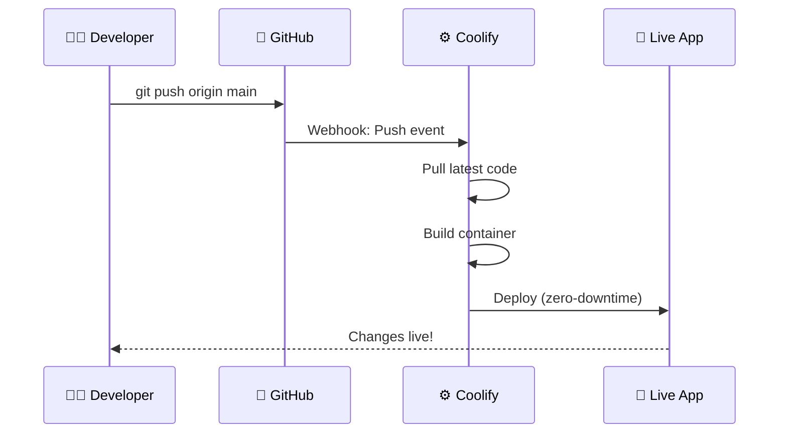

# Coolify Deployment Guide

This guide explains how to prepare and deploy applications to Coolify on the `dvlpid.my.id` infrastructure.

---

## Host Environment

This Coolify instance runs on a Windows PC with Docker Desktop.

### Host Machine

| Property | Value |
|----------|-------|
| **Machine Name** | BPS6104-7 |
| **OS** | Windows 11 |
| **Location** | Office PC (physical machine) |
| **Docker** | Docker Desktop for Windows |
| **Network** | Connected via office LAN |

### Remote Access

| Method | Address | Purpose |
|--------|---------|---------|
| VS Code Remote Tunnel | `vscode.dev/tunnel/bps6104-7` | Remote development & debugging |
| Cloudflare Tunnel | `*.dvlpid.my.id` | Public access to apps |

### Docker Configuration

- **Docker Desktop** runs containers via WSL2 backend
- **Coolify** manages container orchestration
- **Traefik** (coolify-proxy) handles internal routing
- **cloudflared** container connects to Cloudflare Tunnel

### File Locations

| Path | Purpose |
|------|---------|
| `c:\coolify\` | Main Coolify directory |
| `c:\coolify\docker-compose.yml` | Coolify core services |
| `c:\coolify\docker-compose.tunnel.yml` | Cloudflare tunnel container |
| `c:\coolify\references\` | Documentation & guides |

---

## Infrastructure Overview

| Component | Address | Purpose |
|-----------|---------|---------|
| Coolify Dashboard | `https://coolify.dvlpid.my.id` | Management UI |
| Wildcard Domain | `*.dvlpid.my.id` | Auto-routes to Coolify apps |
| Cloudflare Tunnel | `pc1-tunnel` | Secure ingress |
| Traefik Proxy | `coolify-proxy:443` | Routes to containers |
| Logging Stack | `logs.dvlpid.my.id` | Centralized logging (Dozzle/Grafana) |

---

## ⚠️ REQUIREMENTS

### All Apps MUST:

1. **Have a GitHub Repository** - No local deployments
2. **Enable Auto-Deploy** - Push to GitHub = Auto redeploy in Coolify
3. **Use Environment Variables** - For domains and secrets (not hardcoded)
4. **Log to stdout/stderr** - For centralized logging (no file-based logs)

---

## GitHub + Auto-Deploy Setup (GitOps)

### Step 1: Connect GitHub to Coolify (One-time)

1. Go to **Coolify Dashboard** → **Sources**
2. Click **Add Source** → **GitHub App**
3. Follow the OAuth flow to install the Coolify GitHub App
4. Grant access to your repositories (or all repos)

### Step 2: Create App with Auto-Deploy

1. **Create Resource** → Choose type (Application or Docker Compose)
2. **Select Source**: Your connected GitHub account
3. **Select Repository**: Choose the repo
4. **Branch**: Usually `main` or `master`
5. **Build Pack**: Auto-detect or manual (Dockerfile, Nixpacks, Docker Compose)

### Step 3: Enable Webhook (Auto-Deploy on Push)

This is **enabled by default** when using GitHub App. To verify:

1. Go to your app in Coolify
2. Click **Settings** (gear icon)
3. Scroll to **Webhooks**
4. Verify **"Automatic Deployments"** is **ON**

Now every `git push` to the branch triggers automatic rebuild and deploy!

### Workflow

```
Developer pushes code → GitHub → Webhook → Coolify → Build → Deploy → Live!
```



### Branch-Based Deployments

You can set up multiple environments:

| Branch | Domain | Environment |
|--------|--------|-------------|
| `main` | `myapp.dvlpid.my.id` | Production |
| `develop` | `dev-myapp.dvlpid.my.id` | Development |
| `staging` | `staging-myapp.dvlpid.my.id` | Staging |

Create separate Coolify resources for each branch/environment.

---

## Deployment Types

### 1. Single Container App

**Use Coolify UI directly - no Docker files needed.**

1. Go to Coolify → Create Resource → **Application**
2. Connect your GitHub repo
3. Set **Domain**: `myapp.dvlpid.my.id`
4. Deploy

Coolify auto-detects the build method (Dockerfile, Nixpacks, etc.)

---

### 2. Docker Compose App (Multi-Container)

#### Required Modifications

Add these to your `docker-compose.yml`:

```yaml
services:
  # Your public-facing service
  web:
    build: .
    labels:
      - "traefik.enable=true"
      - "traefik.http.routers.${COMPOSE_PROJECT_NAME:-myapp}-web.rule=Host(`${DOMAIN:-myapp.dvlpid.my.id}`)"
      - "traefik.http.routers.${COMPOSE_PROJECT_NAME:-myapp}-web.entrypoints=https"
      - "traefik.http.routers.${COMPOSE_PROJECT_NAME:-myapp}-web.tls=true"
      - "traefik.http.services.${COMPOSE_PROJECT_NAME:-myapp}-web.loadbalancer.server.port=${APP_PORT:-80}"
    networks:
      - coolify
      - default
    environment:
      - APP_URL=https://${DOMAIN:-myapp.dvlpid.my.id}

  # Internal services (no labels needed)
  db:
    image: postgres:15
    volumes:
      - db_data:/var/lib/postgresql/data
    environment:
      POSTGRES_DB: ${DB_NAME:-app}
      POSTGRES_USER: ${DB_USER:-postgres}
      POSTGRES_PASSWORD: ${DB_PASSWORD:-secret}
    # For DBeaver access (see Database Access section)
    ports:
      - "${DB_PORT:-5432}:5432"

  redis:
    image: redis:alpine
    # Internal only - no ports exposed

networks:
  coolify:
    external: true

volumes:
  db_data:
```

#### Environment Variables (Set in Coolify UI)

```env
COMPOSE_PROJECT_NAME=myapp
DOMAIN=myapp.dvlpid.my.id
APP_PORT=80
DB_NAME=myapp
DB_USER=myapp
DB_PASSWORD=supersecret
DB_PORT=5432
```

---

### 3. Internal Host App (Not via Coolify)

For apps running directly on Windows host (not in Docker), like `ai.dvlpid.my.id`:

**No docker-compose changes needed.** Configure in Cloudflare Tunnel Dashboard:

1. Go to Cloudflare Zero Trust → Networks → Tunnels → `pc1-tunnel`
2. Add Public Hostname:
   - Subdomain: `ai`
   - Domain: `dvlpid.my.id`
   - Type: `HTTP`
   - URL: `host.docker.internal:8045`

**Current internal routes:**

| Subdomain | Host Port | Service |
|-----------|-----------|---------|
| `ai.dvlpid.my.id` | 8045 | AI Service |
| `pc1.dvlpid.my.id` | 3012 | PC1 Service |
| `coolify.dvlpid.my.id` | 8000 | Coolify Dashboard |

---

## Database Access via DBeaver

### Expose Database Port Locally

Add port mapping in your compose file:

```yaml
services:
  db:
    image: postgres:15  # or mysql:8, mariadb:10
    ports:
      - "${DB_PORT:-5432}:5432"  # PostgreSQL
      # - "${DB_PORT:-3306}:3306"  # MySQL/MariaDB
```

### DBeaver Connection Settings

| Field | Value |
|-------|-------|
| Host | `127.0.0.1` or `localhost` |
| Port | Value of `DB_PORT` (e.g., `5432`) |
| Database | Value of `DB_NAME` |
| Username | Value of `DB_USER` |
| Password | Value of `DB_PASSWORD` |

### Multiple Database Stacks

Use different ports to avoid conflicts:

```env
# Stack 1 (n8n)
DB_PORT=5432

# Stack 2 (myapp)
DB_PORT=5433

# Stack 3 (another)
DB_PORT=5434
```

### Secure Option (No Permanent Exposure)

Keep ports internal, create temporary tunnel when needed:

```powershell
# Start tunnel
docker run -d --name db-tunnel --network coolify -p 5432:5432 alpine/socat TCP-LISTEN:5432,fork TCP:YOUR_DB_CONTAINER:5432

# Connect with DBeaver on localhost:5432

# Stop when done
docker rm -f db-tunnel
```

---

## Complete Example: Laravel App

### docker-compose.yml

```yaml
version: '3.8'

services:
  app:
    build:
      context: .
      dockerfile: Dockerfile
    labels:
      - "traefik.enable=true"
      - "traefik.http.routers.${COMPOSE_PROJECT_NAME:-laravel}-app.rule=Host(`${DOMAIN:-laravel.dvlpid.my.id}`)"
      - "traefik.http.routers.${COMPOSE_PROJECT_NAME:-laravel}-app.entrypoints=https"
      - "traefik.http.routers.${COMPOSE_PROJECT_NAME:-laravel}-app.tls=true"
      - "traefik.http.services.${COMPOSE_PROJECT_NAME:-laravel}-app.loadbalancer.server.port=80"
    environment:
      APP_NAME: ${APP_NAME:-Laravel}
      APP_ENV: production
      APP_DEBUG: false
      APP_URL: https://${DOMAIN:-laravel.dvlpid.my.id}
      DB_CONNECTION: pgsql
      DB_HOST: db
      DB_PORT: 5432
      DB_DATABASE: ${DB_NAME:-laravel}
      DB_USERNAME: ${DB_USER:-laravel}
      DB_PASSWORD: ${DB_PASSWORD}
      REDIS_HOST: redis
    depends_on:
      - db
      - redis
    networks:
      - coolify
      - default

  db:
    image: postgres:15-alpine
    volumes:
      - db_data:/var/lib/postgresql/data
    environment:
      POSTGRES_DB: ${DB_NAME:-laravel}
      POSTGRES_USER: ${DB_USER:-laravel}
      POSTGRES_PASSWORD: ${DB_PASSWORD}
    ports:
      - "${DB_PORT:-5432}:5432"

  redis:
    image: redis:alpine
    volumes:
      - redis_data:/data

networks:
  coolify:
    external: true

volumes:
  db_data:
  redis_data:
```

### Environment Variables (Coolify UI)

```env
COMPOSE_PROJECT_NAME=laravel
DOMAIN=laravel.dvlpid.my.id
APP_NAME=My Laravel App
DB_NAME=laravel
DB_USER=laravel
DB_PASSWORD=your-secure-password-here
DB_PORT=5436
```

---

## Complete Example: Node.js/Next.js App

### docker-compose.yml

```yaml
version: '3.8'

services:
  app:
    build: .
    labels:
      - "traefik.enable=true"
      - "traefik.http.routers.${COMPOSE_PROJECT_NAME:-nextjs}-app.rule=Host(`${DOMAIN:-nextjs.dvlpid.my.id}`)"
      - "traefik.http.routers.${COMPOSE_PROJECT_NAME:-nextjs}-app.entrypoints=https"
      - "traefik.http.routers.${COMPOSE_PROJECT_NAME:-nextjs}-app.tls=true"
      - "traefik.http.services.${COMPOSE_PROJECT_NAME:-nextjs}-app.loadbalancer.server.port=3000"
    environment:
      NODE_ENV: production
      NEXT_PUBLIC_API_URL: https://${DOMAIN:-nextjs.dvlpid.my.id}/api
    networks:
      - coolify
      - default

networks:
  coolify:
    external: true
```

---

## Checklist Before Deploying

### Repository Setup
- [ ] Code is in a **GitHub repository**
- [ ] GitHub connected to Coolify (Sources → GitHub App)
- [ ] Repository granted access to Coolify GitHub App

### Docker Configuration
- [ ] Added Traefik labels to public service(s)
- [ ] Added `coolify` network (external: true)
- [ ] Used environment variables for domain (`${DOMAIN}`)
- [ ] Used `${COMPOSE_PROJECT_NAME}` in router names (prevents conflicts)

### Database (if applicable)
- [ ] Exposed database port if DBeaver access needed
- [ ] Set unique `DB_PORT` if multiple stacks have databases

### Auto-Deploy
- [ ] **Automatic Deployments** enabled in Coolify app settings
- [ ] Correct branch selected (main, develop, etc.)
- [ ] Test: Push a small change and verify it auto-deploys

### Logging
- [ ] App logs to **stdout/stderr** (not files)
- [ ] Logging stack deployed (Dozzle at minimum)
- [ ] Verify logs appear in `logs.dvlpid.my.id`

---

## Logging & Monitoring

### Architecture

Logging is **centralized** - deploy the logging stack **ONCE**, not per-app.

```
┌─────────────────────────────────────────────────────────┐
│                     COOLIFY                              │
│                                                          │
│  ┌────────────────────────────────────────────────────┐ │
│  │         LOGGING STACK (Deploy Once)                │ │
│  │  ┌─────────┐  ┌─────────┐  ┌─────────┐             │ │
│  │  │ Dozzle  │  │  Loki   │  │ Grafana │             │ │
│  │  └────┬────┘  └────┬────┘  └────┬────┘             │ │
│  │       └────────────┴────────────┘                  │ │
│  │              Reads Docker Socket                   │ │
│  └────────────────────────────────────────────────────┘ │
│                          ▲                               │
│                          │ Collects logs from            │
│                          ▼                               │
│  ┌────────────────────────────────────────────────────┐ │
│  │               ALL YOUR APPS                        │ │
│  │  ┌───────┐ ┌───────┐ ┌───────┐ ┌───────┐          │ │
│  │  │ App 1 │ │ App 2 │ │ App 3 │ │ App N │          │ │
│  │  └───────┘ └───────┘ └───────┘ └───────┘          │ │
│  └────────────────────────────────────────────────────┘ │
└─────────────────────────────────────────────────────────┘
```

### Logging Stack Components

| Component | Purpose | Access |
|-----------|---------|--------|
| **Dozzle** | Real-time log viewer for ALL containers | `logs.dvlpid.my.id` |
| **Loki** | Log storage & indexing | Internal only |
| **Grafana** | Dashboards, search, alerts | `grafana.dvlpid.my.id` |

### App Requirements for Logging

**Apps must log to stdout/stderr** (not files). Most frameworks do this by default.

```javascript
// Node.js - ✅ Correct
console.log('Info message');
console.error('Error message');

// ❌ Wrong - don't log to files
fs.writeFileSync('/var/log/app.log', message);
```

```python
# Python - ✅ Correct
import logging
logging.basicConfig(level=logging.INFO)
logger = logging.getLogger(__name__)
logger.info('Message')  # Goes to stderr by default
```

```php
// Laravel - ✅ Correct (set in .env)
LOG_CHANNEL=stderr
```

### Quick Setup: Dozzle (5 minutes)

Deploy via Docker Compose in Coolify:

```yaml
services:
  dozzle:
    image: amir20/dozzle:latest
    volumes:
      - /var/run/docker.sock:/var/run/docker.sock:ro
      - dozzle_config:/data
    environment:
      - DOZZLE_AUTH_PROVIDER=simple
    labels:
      - "traefik.enable=true"
      - "traefik.http.routers.dozzle.rule=Host(`logs.dvlpid.my.id`)"
      - "traefik.http.routers.dozzle.entrypoints=https"
      - "traefik.http.routers.dozzle.tls=true"
      - "traefik.http.services.dozzle.loadbalancer.server.port=8080"
    networks:
      - coolify

networks:
  coolify:
    external: true

volumes:
  dozzle_config:
    external: true
```

### Dozzle Authentication Setup

> [!IMPORTANT]
> `DOZZLE_USERNAME` and `DOZZLE_PASSWORD` env vars are **DEPRECATED** in latest Dozzle.
> You must use a `users.yml` file.

**Step 1: Generate hashed password**

```powershell
docker run --rm amir20/dozzle:latest generate admin --password "YourPassword123!"
```

This outputs YAML content with a bcrypt-hashed password.

**Step 2: Create `dozzle_users.yml` file**

```yaml
users:
  admin:
    email: ""
    name: "Admin User"
    password: $2a$11$YOUR_HASHED_PASSWORD_HERE
```

**Step 3: Create and populate Docker volume**

```powershell
# Create volume
docker volume create dozzle_config

# Copy users.yml into volume (replace path as needed)
docker run --rm -v c:/coolify/dozzle_users.yml:/tmp/users.yml -v dozzle_config:/data alpine cp /tmp/users.yml /data/users.yml
```

**Step 4: Deploy in Coolify**

After Coolify creates the stack, you may need to copy the `users.yml` into Coolify's auto-generated volume:

```powershell
# Find Coolify's volume name
docker volume ls --filter "name=dozzle"

# Copy into Coolify's volume (replace VOLUME_NAME)
docker run --rm -v dozzle_config:/src -v VOLUME_NAME:/dst alpine cp /src/users.yml /dst/users.yml

# Restart Dozzle
docker restart DOZZLE_CONTAINER_NAME
```

### Full Setup: Loki + Grafana + Dozzle

For production with search, retention, and dashboards:

```yaml
services:
  dozzle:
    image: amir20/dozzle:latest
    volumes:
      - /var/run/docker.sock:/var/run/docker.sock:ro
    labels:
      - "traefik.enable=true"
      - "traefik.http.routers.dozzle.rule=Host(`logs.dvlpid.my.id`)"
      - "traefik.http.routers.dozzle.entrypoints=https"
      - "traefik.http.routers.dozzle.tls=true"
      - "traefik.http.services.dozzle.loadbalancer.server.port=8080"
    networks:
      - coolify

  loki:
    image: grafana/loki:latest
    command: -config.file=/etc/loki/local-config.yaml
    volumes:
      - loki_data:/loki

  grafana:
    image: grafana/grafana:latest
    environment:
      - GF_SECURITY_ADMIN_PASSWORD=${GRAFANA_PASSWORD:-admin}
    volumes:
      - grafana_data:/var/lib/grafana
    labels:
      - "traefik.enable=true"
      - "traefik.http.routers.grafana.rule=Host(`grafana.dvlpid.my.id`)"
      - "traefik.http.routers.grafana.entrypoints=https"
      - "traefik.http.routers.grafana.tls=true"
      - "traefik.http.services.grafana.loadbalancer.server.port=3000"
    networks:
      - coolify

networks:
  coolify:
    external: true

volumes:
  loki_data:
  grafana_data:
```

### Viewing Logs

| Method | When to Use |
|--------|-------------|
| **Dozzle** (`logs.dvlpid.my.id`) | Real-time debugging, view all containers |
| **Grafana** (`grafana.dvlpid.my.id`) | Search historical logs, create dashboards |
| **Coolify UI** → Logs tab | Quick check single app |
| `docker logs -f container` | CLI access when connected via VS Code Tunnel |

---

## Troubleshooting

### 404 Not Found
- Check Traefik labels are correct
- Verify container is on `coolify` network
- Check `APP_PORT` matches your app's listening port

### 502 Bad Gateway
- Container is starting/crashed - check logs in Dozzle
- Wrong port in loadbalancer.server.port

### ERR_TOO_MANY_REDIRECTS
- Use `https` entrypoint in labels
- Don't force HTTPS redirect in your app (Cloudflare handles it)

### Database Connection Refused
- Use service name as host (e.g., `db`), not `localhost`
- Check port mapping matches
- Verify credentials match environment variables

### Logs Not Appearing in Dozzle
- App might be logging to files instead of stdout/stderr
- Check `LOG_CHANNEL=stderr` (Laravel) or equivalent
- Container might not be on same Docker host
