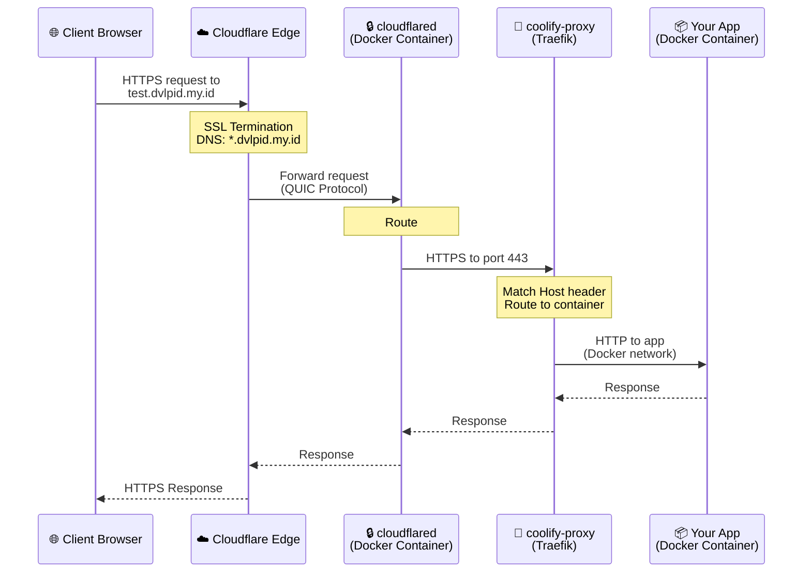
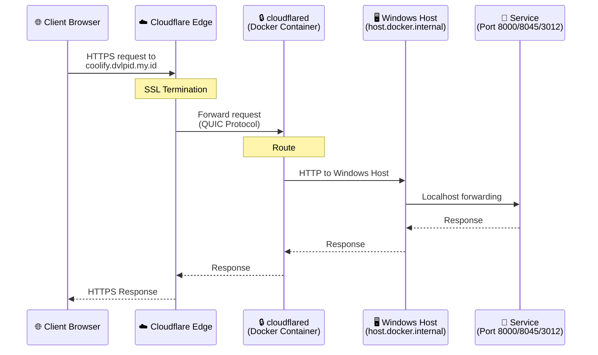
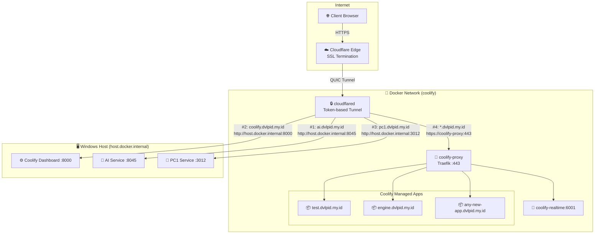

# Traffic Flow Diagram

## Overview

This document explains how traffic flows from clients to your applications hosted on this setup.

---

## Coolify Apps (*.dvlpid.my.id via Traefik)

---

## Direct Host Apps (coolify, ai, pc1)

---

## Architecture Overview

---

## Route Configuration (Cloudflare Tunnel Dashboard)

| Priority | Subdomain | Service | Notes |
|----------|-----------|---------|-------|
| 1 | `ai.dvlpid.my.id` | `http://host.docker.internal:8045` | AI Service on Windows |
| 2 | `coolify.dvlpid.my.id` | `http://host.docker.internal:8000` | Coolify Dashboard |
| 3 | `pc1.dvlpid.my.id` | `http://host.docker.internal:3012` | PC1 Service |
| 4 | `*.dvlpid.my.id` | `https://coolify-proxy:443` | **Wildcard (LAST!)** - All Coolify apps |

⚠️ **Important:** The wildcard route **MUST be last** so specific routes match first!

---

## Key Points

1. **Cloudflare handles SSL** - All public traffic is HTTPS
2. **Tunnel runs in Docker** - Stable networking via `docker-compose.tunnel.yml`
3. **Route order matters** - Specific routes BEFORE wildcard
4. **host.docker.internal** - Special DNS for reaching Windows host from containers
5. **Traefik routes by hostname** - Automatically routes to correct Coolify app container
6. **No TLS Verify** - Required for wildcard route (self-signed cert on Traefik)

---

## Files

| File | Purpose |
|------|---------|
| `c:\coolify\docker-compose.tunnel.yml` | Cloudflared tunnel container |
| `c:\coolify\docker-compose.yml` | Main Coolify services |
| Cloudflare Dashboard | Route configuration (dashboard-managed) |
